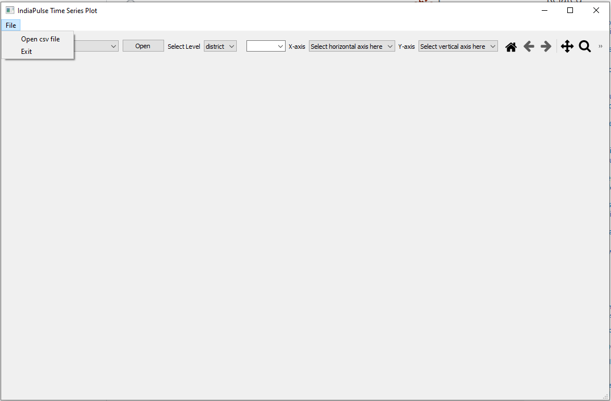
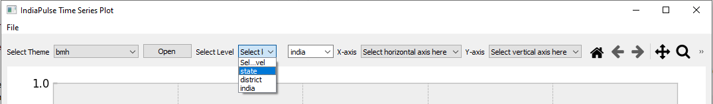
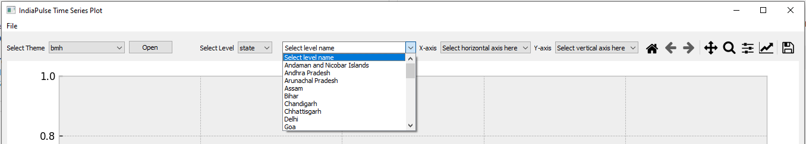
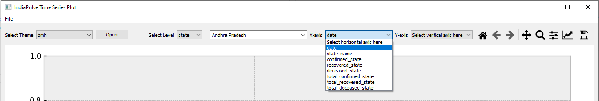
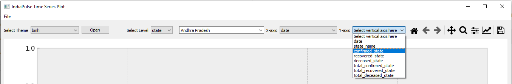
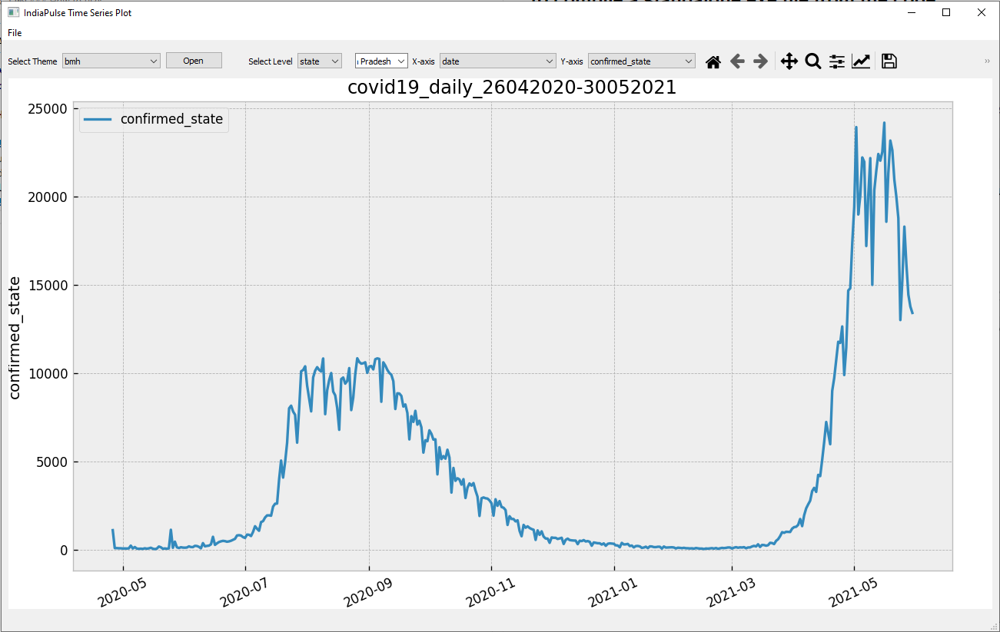

### To replicate the application local system perform the following steps:
- Clone the repo
- Run `pip install -r requirements.txt` in your virtual environment.
- To test the application run:
    ```
    python3 drag_drop.py
        or 
    python drag_drop.py
    ```
- If you are experiencing this kind of error:
    ```
    from matplotlib import ft2font: “ImportError: DLL load failed: The specified procedure could not be found.”
    ```
    - Then first uninstall the matplotlib using:
        ```pip3 uninstall matplotlib```
    - Install the Microsoft Visual C Runtime:
        ```pip3 install msvc-runtime```
    - Then install the matplotlib:
        ```pip3 install --upgrade matplotlib```

### To compile a standalone exe file from the code:
- Install pyinstaller 
    ```pip install pyinstaller```
- Run the following command:
    ```pyinstaller --onefile --windowed drag_drop.py```


    Note: Make sure you have PyQt version 5.15.3 installed. Otherwise you will get this error with pyinstaller

    ```
    AttributeError: Module 'PyQt5' has no attribute '__version__'
    ```
    **This is still buggy and does work everytime on windows. Prefer the python run method**

### How to use:
- On running the application you will get the following window:
    
- You can either select **Open csv file** from File menu, or you can simply drag and drop the csv file in empty area
- Select the spatial level on which you want to visualize
    
- This will populate the list of states from data file in the next dropdown. Select the state whose data you want to visualize:
    
- Now, select **date** from the x-axis dropdown
    
- Now, select the indicator you want to view from the Y-axis dropdown. Notice that the indicators shown are only with the **_state** suffix. These are filtered on the basis of spatial level you selected on the first step.
    
- See the final result
    

